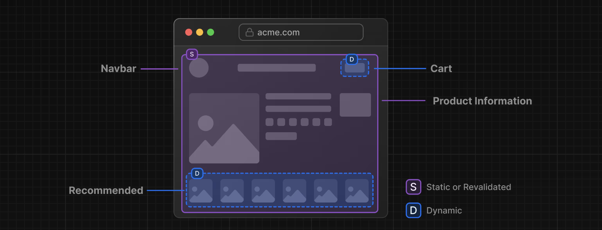

# 第10章 部分的なプリレンダリング
これまで、静的レンダリングと動的レンダリング、そしてデータに依存する動的コンテンツのストリーミング方法について学んできました。この章では、部分プリレンダリング（PPR）を使って、静的レンダリング、動的レンダリング、ストリーミングを同じルートで組み合わせる方法を学びましょう。

部分プリレンダリングは、Next.js 14で導入された実験的な機能です。このページの内容は、この機能が安定するにつれて更新される可能性があります。

## この章では...

この章で取り上げるトピックは次のとおりです。

* 部分プリレンダリングとは何か
* 部分プリレンダリングの仕組み

## 静的ルートと動的ルート
現在構築されているほとんどのWebアプリケーションでは、アプリケーション全体または特定のルートに対して、静的レンダリングと動的レンダリングのどちらかを選択します。また、Next.jsでは、ルート内で動的な関数（データベースへの問い合わせなど）を呼び出すと、ルート全体が動的になります。

しかし、ほとんどのルートは完全に静的でも動的でもありません。たとえば、eコマースサイトを考えてみましょう。商品情報ページの大部分は静的にレンダリングしたいかもしれませんが、ユーザーのカートとおすすめ商品を動的に取得したいかもしれません。

ダッシュボードのページに戻って、静的と動的ではどのようなコンポーネントを考慮しますか？

準備ができたら、下のボタンをクリックして、ダッシュボードのルートをどのように分割するか見てみましょう

* `<SideNav>`コンポーネントはデータに依存せず、ユーザーに合わせてカスタマイズされないので、静的であることができます。
* `<Page>`のコンポーネントは、頻繁に変更されるデータに依存し、ユーザーにパーソナライズされるので、動的であることができます。

## 部分プリレンダリングとは？
Next.js 14では、部分プリレンダリングの実験的なバージョンが導入されました。これは、静的レンダリングと動的レンダリングの利点を同じルートで組み合わせることができる新しいレンダリングモデルです。たとえば

ユーザーがルートにアクセスすると

* ナビバーと商品情報を含む静的なルートシェルが提供され、高速な初期ロードを保証します。
* シェルは、カートやおすすめ商品のような動的コンテンツが非同期にロードされる穴を残します。
* 非同期のホールは並列にストリーミングされ、ページ全体のロード時間を短縮します。

## 部分プリレンダリングの仕組み
部分的なプリレンダリングは、Reactのサスペンス（前の章で学びました）を使用して、何らかの条件が満たされるまで（たとえばデータが読み込まれるまで）アプリケーションの一部のレンダリングを延期します。

サスペンスのフォールバックは、静的コンテンツと一緒に最初のHTMLファイルに埋め込まれます。ビルド時 (または再検証時) に静的コンテンツはプリレンダリングされ、静的シェルが作成されます。動的コンテンツのレンダリングは、ユーザがルートを要求するまで延期されます。

コンポーネントをSuspenseでラップしても、コンポーネント自体が動的になるわけではありません。むしろ、Suspenseは静的コードと動的コードの境界として使用されます。

ダッシュボードルートに PPR を実装する方法を見てみましょう。
