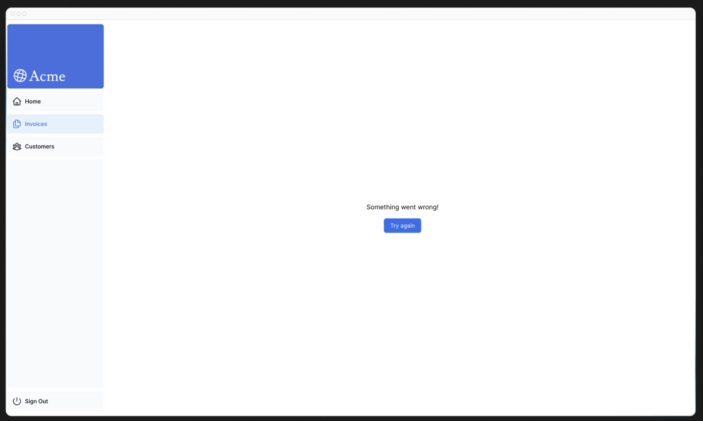
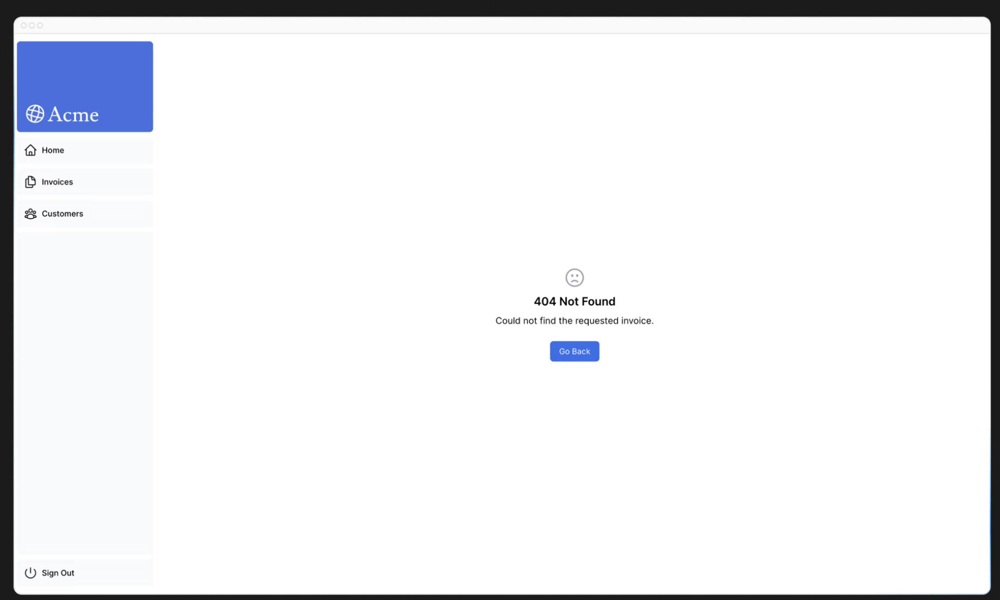

# 第13章 エラーの処理
前の章では、サーバーアクションを使用してデータを変更する方法を学びました。JavaScriptのtry/catch文とNext.js APIを使って、エラーを優雅に処理する方法を見てみましょう。

## この章では...

この章で取り上げるトピックは次のとおりです。

* 特別なerror.tsxファイルを使用して、ルートセグメントでエラーをキャッチし、ユーザーにフォールバックUIを表示する方法。
* notFound関数とnot-foundファイルを使用して、404エラー（存在しないリソース）を処理する方法。

## サーバーアクションに try/catch を追加する
まず、JavaScriptのtry/catch文をサーバーアクションに追加して、エラーを優雅に処理できるようにしましょう。

この方法を知っている場合は、数分かけてサーバーアクションを更新してください

```typescript
// app/lib/actions.ts

export async function createInvoice(formData: FormData) {
  const { customerId, amount, status } = CreateInvoice.parse({
    customerId: formData.get('customerId'),
    amount: formData.get('amount'),
    status: formData.get('status'),
  });

  const amountInCents = amount * 100;
  const date = new Date().toISOString().split('T')[0];

  try {
    await sql`
      INSERT INTO invoices (customer_id, amount, status, date)
      VALUES (${customerId}, ${amountInCents}, ${status}, ${date})
    `;
  } catch (error) {
    return {
      message: 'Database Error: Failed to Create Invoice.',
    };
  }

  revalidatePath('/dashboard/invoices');
  redirect('/dashboard/invoices');
}

export async function updateInvoice(id: string, formData: FormData) {
  const { customerId, amount, status } = UpdateInvoice.parse({
    customerId: formData.get('customerId'),
    amount: formData.get('amount'),
    status: formData.get('status'),
  });

  const amountInCents = amount * 100;

  try {
    await sql`
        UPDATE invoices
        SET customer_id = ${customerId}, amount = ${amountInCents}, status = ${status}
        WHERE id = ${id}
      `;
  } catch (error) {
    return { message: 'Database Error: Failed to Update Invoice.' };
  }

  revalidatePath('/dashboard/invoices');
  redirect('/dashboard/invoices');
}

export async function deleteInvoice(id: string) {
  try {
    await sql`DELETE FROM invoices WHERE id = ${id}`;
    revalidatePath('/dashb  oard/invoices');
    return { message: 'Deleted Invoice.' };
  } catch (error) {
    return { message: 'Database Error: Failed to Delete Invoice.' };
  }
}
```

redirectがtry/catchブロックの外で呼び出されていることに注目してほしい。これは、redirectがエラーを投げて動作するためで、ブロック内で呼び出されるとcatchブロックによって捕捉されることになる。これを避けるには、try/catchブロックの後でredirectを呼び出せばよい。

では、Server Actionでエラーがスローされたときにどうなるかを確認してみましょう。これは、先にエラーを投げることで可能です。例えば、deleteInvoiceアクションでは、関数の先頭でエラーをスローします

```typescript
// app/lib/actions.ts

export async function deleteInvoice(id: string) {
  throw new Error('Failed to Delete Invoice');

  // Unreachable code block
  try {
    await sql`DELETE FROM invoices WHERE id = ${id}`;
    revalidatePath('/dashboard/invoices');
    return { message: 'Deleted Invoice' };
  } catch (error) {
    return { message: 'Database Error: Failed to Delete Invoice' };
  }
}
```

請求書を削除しようとすると、localhost上でエラーが表示されます。テスト後、次のセクションに進む前に、必ずこのエラーを削除してください。

このようなエラーが表示されると、潜在的な問題を早期に発見できるので、開発中に役立ちます。しかし、突然の失敗を避け、アプリケーションの実行を継続できるようにするために、ユーザーにエラーを表示することも必要です。

そこで、Next.jsのerror.tsxファイルの出番です。

## error.tsxですべてのエラーを処理する
error.tsxファイルは、ルートセグメントのUI境界を定義するために使用できます。これは、予期しないエラーのためのキャッチオールとして機能し、ユーザーにフォールバックUIを表示することができます。

dashboard/invoicesフォルダ内に、error.tsxという新しいファイルを作成し、以下のコードを貼り付けます

```tsx
// dashboard/invoices/error.tsx

'use client';

import { useEffect } from 'react';

export default function Error({
  error,
  reset,
}: {
  error: Error & { digest?: string };
  reset: () => void;
}) {
  useEffect(() => {
    // Optionally log the error to an error reporting service
    console.error(error);
  }, [error]);

  return (
    <main className="flex h-full flex-col items-center justify-center">
      <h2 className="text-center">Something went wrong!</h2>
      <button
        className="mt-4 rounded-md bg-blue-500 px-4 py-2 text-sm text-white transition-colors hover:bg-blue-400"
        onClick={
          // Attempt to recover by trying to re-render the invoices route
          () => reset()
        }
      >
        Try again
      </button>
    </main>
  );
}
```

上のコードにはいくつか注意すべき点があります

* use client" - error.tsxはClient Componentである必要があります。
* これは、2つのpropsを受け入れます
  * error： このオブジェクトは、JavaScriptのネイティブErrorオブジェクトのインスタンスです。
  * reset： これは、エラー境界をリセットするための関数です。実行されると、この関数はルートセグメントの再レンダリングを試みます。

再度請求書を削除しようとすると、以下のようなUIが表示されるはずです



## notFound関数で404エラーを処理する
エラーを潔く処理するもう一つの方法は、notFound関数を使うことです。error.tsxはすべてのエラーをキャッチするのに便利ですが、notFoundは存在しないリソースを取得しようとしたときに使用できます。

例えば、http://localhost:3000/dashboard/invoices/2e94d1ed-d220-449f-9f11-f0bbceed9645/edit

これはデータベースに存在しない偽のUUIDです。

error.tsxが定義されている/invoicesの子ルートなので、すぐにerror.tsxがキックされるのがわかるでしょう。

しかし、より具体的にしたい場合は、アクセスしようとしているリソースが見つからないことをユーザーに伝えるために404エラーを表示することができます。

リソースが見つかっていないことは、data.tsのfetchInvoiceById関数に入り、返された請求書をコンソールロギングすることで確認できます

```typescript
// app/lib/data.ts

export async function fetchInvoiceById(id: string) {
  try {
    // ...

    console.log(invoice); // Invoice is an empty array []
    return invoice[0];
  } catch (error) {
    console.error('Database Error:', error);
    throw new Error('Failed to fetch invoice.');
  }
}
```

請求書がデータベースに存在しないことがわかったので、notFoundを使って処理してみましょう。dashboard/invoices/[id]/edit/page.tsxに移動し、'next/navigation'から{ notFound }をインポートします。

そして、請求書が存在しない場合にnotFoundを呼び出す条件を使用します

```tsx
// dashboard/invoices/[id]/edit/page.tsx

import { fetchInvoiceById, fetchCustomers } from '@/app/lib/data';
import { updateInvoice } from '@/app/lib/actions';
import { notFound } from 'next/navigation';

export default async function Page(props: { params: Promise<{ id: string }> }) {
  const params = await props.params;
  const id = params.id;
  const [invoice, customers] = await Promise.all([
    fetchInvoiceById(id),
    fetchCustomers(),
  ]);

  if (!invoice) {
    notFound();
  }

  // ...
}
```

完璧です！`<Page>`は、特定の請求書が見つからない場合にエラーを投げるようになりました。ユーザーにエラーUIを表示するには editフォルダ内にnot-found.tsxファイルを作成します。

次に、not-found.tsxファイルの中に、以下のコードを貼り付ける

```tsx
// dashboard/invoices/[id]/edit/not-found.tsx

import Link from 'next/link';
import { FaceFrownIcon } from '@heroicons/react/24/outline';

export default function NotFound() {
  return (
    <main className="flex h-full flex-col items-center justify-center gap-2">
      <FaceFrownIcon className="w-10 text-gray-400" />
      <h2 className="text-xl font-semibold">404 Not Found</h2>
      <p>Could not find the requested invoice.</p>
      <Link
        href="/dashboard/invoices"
        className="mt-4 rounded-md bg-blue-500 px-4 py-2 text-sm text-white transition-colors hover:bg-blue-400"
      >
        Go Back
      </Link>
    </main>
  );
}
```
ルートを更新すると、次のようなUIが表示されます



notFoundはerror.tsxよりも優先されるので、より具体的なエラーに対処したい場合は、notFoundを使うことができる！

## さらに読む
Next.jsのエラー処理については、以下のドキュメントをご覧ください

* [エラー処理](https://nextjs.org/docs/app/building-your-application/routing/error-handling)
* [error.js APIリファレンス](https://nextjs.org/docs/app/api-reference/file-conventions/error)
* [notFound() API リファレンス](https://nextjs.org/docs/app/api-reference/functions/not-found)
* [not-found.js APIリファレンス](https://nextjs.org/docs/app/api-reference/file-conventions/not-found)

第13章終了

アプリケーションで優雅にエラーを処理できるようになりましたね。
