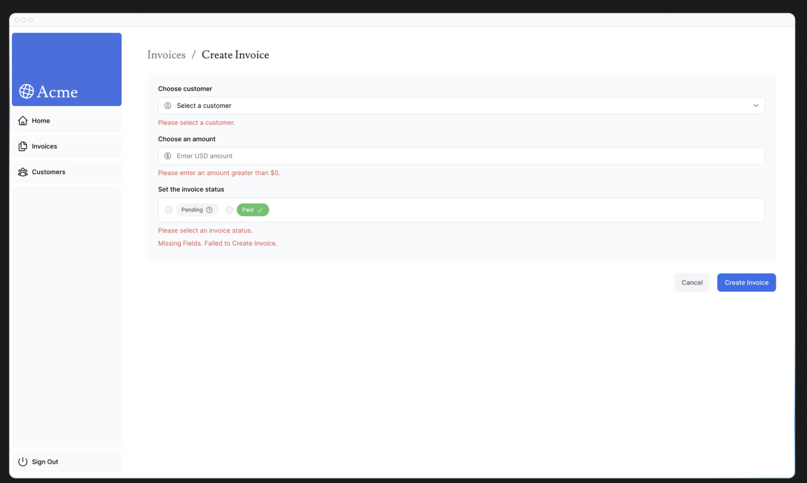

# 第14章 アクセシビリティの向上
前の章では、エラー（404エラーを含む）をキャッチし、ユーザーにフォールバックを表示する方法について見てきました。しかし、パズルのもう1つのピースであるフォームバリデーションについてはまだ説明する必要があります。サーバーアクションを使ってサーバーサイドのバリデーションを実装する方法と、ReactのuseActionStateフックを使ってフォームエラーを表示する方法を、アクセシビリティを考慮しながら見ていきましょう！

## この章では...

この章で扱うトピックは次のとおりです。

* Next.jsでeslint-plugin-jsx-a11yを使用してアクセシビリティのベストプラクティスを実装する方法。
* サーバーサイドのフォームバリデーションを実装する方法
* ReactのuseActionStateフックを使用してフォームエラーを処理し、ユーザーに表示する方法。

## アクセシビリティとは何ですか？
アクセシビリティとは、障害のある人を含め、誰もが使用できるWebアプリケーションを設計し、実装することを指します。キーボードナビゲーション、セマンティックHTML、画像、色、動画など、多くの領域をカバーする広大なトピックです。

このコースではアクセシビリティについて深く掘り下げませんが、Next.jsで利用可能なアクセシビリティ機能と、アプリケーションをよりアクセシブルにするための一般的なプラクティスについて説明します。

アクセシビリティについてもっと学びたい方は、web.dev.jpのLearn Accessibilityコースをおすすめします。

## Next.jsでESLintアクセシビリティプラグインを使う
Next.jsでは、アクセシビリティの問題を早期に発見するために、ESLint設定にeslint-plugin-jsx-a11yプラグインが含まれています。たとえば、altテキストがない画像や、aria-*属性やrole属性の間違った使い方などを警告します。

オプションとして、これを試したい場合は、package.jsonファイルにスクリプトとしてnext lintを追加してください

```json
// package.json

"scripts": {
    "build": "next build",
    "dev": "next dev",
    "start": "next start",
    "lint": "next lint"
},
```

それからターミナルで`pnpm lint`を実行する

これはあなたのプロジェクトにESLintをインストールし、設定するためのガイドです。今 pnpm lint を実行すると、次のような出力が表示されるはずです

```bash
✔ No ESLint warnings or errors
```

しかし、altテキストがない画像があったらどうなるでしょうか？調べてみましょう！

/app/ui/invoices/table.tsxに行き、画像からalt propを削除してください。エディタの検索機能を使えば、`<Image>`をすぐに見つけることができます

```tsx
// app/ui/invoices/table.tsx

<Image
  src={invoice.image_url}
  className="rounded-full"
  width={28}
  height={28}
  alt={`${invoice.name}'s profile picture`} // Delete this line
/>
```

もう一度pnpm lintを実行すると、次のような警告が表示されるはずだ

```bash
./app/ui/invoices/table.tsx
45:25  Warning: Image elements must have an alt prop,
either with meaningful text, or an empty string for decorative images. jsx-a11y/alt-text
```

リンターの追加と設定は必須のステップではありませんが、開発プロセスでアクセシビリティの問題を発見するのに役立ちます。

## フォームのアクセシビリティを改善する
以下の3点は、すでにフォームのアクセシビリティを向上させるために行っていることです。

* セマンティックHTML: `<div>` の代わりに `<input>` や `<option>` などのセマンティック要素を使うようにしています。これにより、支援技術（AT）は入力要素に集中でき、ユーザーに適切な文脈情報を提供できます。その結果、フォームの操作や理解が容易になります。
* ラベリング: `<label>` と htmlFor 属性を利用して、各フォームフィールドにわかりやすいテキストラベルを付けています。支援技術への対応が向上するだけでなく、ユーザビリティも向上します。ラベルをクリックすると、対応する入力欄にフォーカスが移るので操作がしやすくなります。
* フォーカスアウトライン: フィールドにフォーカスが当たったとき、アウトラインが正しく表示されるようにスタイリングしています。これはアクセシビリティにおいて非常に重要で、画面上でアクティブな要素がどれかを示し、キーボードやスクリーンリーダーの利用者がフォーム上の現在地を把握しやすくなります。Tabキーを押して動作を確認できます。

これらのプラクティスは、多くのユーザーにとってフォームのアクセシビリティを向上させる重要な土台となります。ただし、フォームのバリデーションやエラー処理については、これらだけでは十分にカバーできません。

## フォームの検証
http://localhost:3000/dashboard/invoices/create へ遷移し、空のフォームを送信します。どうなりますか？

エラーが発生します！これは、空のフォーム値をサーバーアクションに送信しているからです。クライアントまたはサーバーでフォームのバリデーションを行うことで、これを防ぐことができます。

### クライアントサイドのバリデーション
フォームをクライアント側でバリデートする方法はいくつかあります。最も簡単な方法は、フォーム内の `<input>` や `<select>` 要素に required 属性を追加して、ブラウザが提供するフォームバリデーションに依存することです。例えば

```tsx
// app/ui/invoices/create-form.tsx

<input
  id="amount"
  name="amount"
  type="number"
  placeholder="Enter USD amount"
  className="peer block w-full rounded-md border border-gray-200 py-2 pl-10 text-sm outline-2 placeholder:text-gray-500"
  required
/>
```

もう一度フォームを送信してください。空の値でフォームを送信しようとすると、ブラウザは警告を表示する。

ATの中にはブラウザのバリデーションをサポートしているものもあるので、この方法は一般的に問題ありません。

クライアントサイドのバリデーションに代わるものとして、サーバーサイドのバリデーションがあります。次のセクションで実装方法を見てみましょう。とりあえず、必須属性を追加した場合は削除してください。

### サーバーサイドでのバリデーション
サーバ上でフォームのバリデーションを行うことで、以下のことが可能になります

* データベースにデータを送信する前に、データが期待される形式であることを確認する。
* 悪意のあるユーザーがクライアント側のバリデーションをバイパスするリスクを減らす。
* 何が有効なデータであるか、真実の情報源を1つにする。

create-form.tsxコンポーネントで、reactからuseActionStateフックをインポートします。useActionStateはフックなので、「use client 」ディレクティブを使ってフォームをクライアントコンポーネントにする必要があります

```tsx
// app/ui/invoices/create-form.tsx

'use client';

// ...
import { useActionState } from 'react';
```

フォームコンポーネントの中にある useActionState フックです

* 2つの引数を取ります： `(action、initialState)`
* 2つの値を返します： `[state, formAction]` - フォームの状態と、フォームが送信されたときに呼び出される関数

useActionStateの引数としてcreateInvoiceアクションを渡し、`<form action={}>`属性内でformActionを呼び出します。

```tsx
// app/ui/invoices/create-form.tsx

// ...
import { useActionState } from 'react';

export default function Form({ customers }: { customers: CustomerField[] }) {
  const [state, formAction] = useActionState(createInvoice, initialState);

  return <form action={formAction}>...</form>;
}
```

この場合、messageとerrorsという2つの空のキーを持つオブジェクトを作成し、actions.tsファイルからState型をインポートします

```tsx
// app/ui/invoices/create-form.tsx

// ...
import { createInvoice, State } from '@/app/lib/actions';
import { useActionState } from 'react';

export default function Form({ customers }: { customers: CustomerField[] }) {
  const initialState: State = { message: null, errors: {} };
  const [state, formAction] = useActionState(createInvoice, initialState);

  return <form action={formAction}>...</form>;
}
```

最初は混乱するかもしれませんが、サーバーアクションを更新すれば、もっと理解できるようになります。では、そうしましょう。

action.tsファイルでは、Zodを使ってフォームデータを検証することができます。FormSchemaを次のように更新してください

```typescript
// app/lib/actions.ts

const FormSchema = z.object({
  id: z.string(),
  customerId: z.string({
    invalid_type_error: 'Please select a customer.',
  }),
  amount: z.coerce
    .number()
    .gt(0, { message: 'Please enter an amount greater than $0.' }),
  status: z.enum(['pending', 'paid'], {
    invalid_type_error: 'Please select an invoice status.',
  }),
  date: z.string(),
});
```

* customerId - Zodは、文字列型を想定しているため、customerフィールドが空の場合、すでにエラーを投げています。しかし、ユーザーが顧客を選択しなかった場合にフレンドリーなメッセージを追加しましょう。
* amount - 金額の型を文字列から数値に強制しているので、文字列が空の場合はデフォルトでゼロになります。.gt()関数を使って、常に0より大きい金額を表示するようにしましょう。
* status - Zodはすでにstatusフィールドが空だとエラーを投げています。ユーザーがステータスを選択しなかった場合のフレンドリーなメッセージも追加しましょう。

次に、createInvoiceアクションを更新して、prevStateとformDataの2つのパラメータを受け取れるようにします

```typescript
// app/lib/actions.ts

export type State = {
  errors?: {
    customerId?: string[];
    amount?: string[];
    status?: string[];
  };
  message?: string | null;
};

export async function createInvoice(prevState: State, formData: FormData) {
  // ...
}
```

* formData - 前と同じ。
* prevState - useActionStateフックから渡された状態を含みます。この例ではアクションで使うことはありませんが、必須のプロップです。

次に、Zodのparse()関数をsafeParse()に変更します

```typescript
// app/lib/actions.ts

export async function createInvoice(prevState: State, formData: FormData) {
  // Validate form fields using Zod
  const validatedFields = CreateInvoice.safeParse({
    customerId: formData.get('customerId'),
    amount: formData.get('amount'),
    status: formData.get('status'),
  });

  // ...
}
```

safeParse()は、成功フィールドかエラーフィールドを含むオブジェクトを返します。これにより、try/catchブロック内にこのロジックを記述しなくても、バリデーションをより優雅に処理できるようになります。

情報をデータベースに送信する前に、フォームフィールドが正しくバリデートされたかどうかを条件式でチェックします

```typescript
// app/lib/actions.ts

export async function createInvoice(prevState: State, formData: FormData) {
  // Validate form fields using Zod
  const validatedFields = CreateInvoice.safeParse({
    customerId: formData.get('customerId'),
    amount: formData.get('amount'),
    status: formData.get('status'),
  });

  // If form validation fails, return errors early. Otherwise, continue.
  if (!validatedFields.success) {
    return {
      errors: validatedFields.error.flatten().fieldErrors,
      message: 'Missing Fields. Failed to Create Invoice.',
    };
  }

  // ...
}
```

validatedFieldsが成功しなかった場合は、Zodからのエラーメッセージとともに関数を早期に返します。

ヒント: console.logでvalidatedFieldsを表示し、空のフォームを送信してその形を確認します。

最後に、try/catchブロックの外でフォームのバリデーションを個別に処理しているので、データベースのエラーに対して特定のメッセージを返すことができます

```typescript
// app/lib/actions.ts

export async function createInvoice(prevState: State, formData: FormData) {
  // Validate form using Zod
  const validatedFields = CreateInvoice.safeParse({
    customerId: formData.get('customerId'),
    amount: formData.get('amount'),
    status: formData.get('status'),
  });

  // If form validation fails, return errors early. Otherwise, continue.
  if (!validatedFields.success) {
    return {
      errors: validatedFields.error.flatten().fieldErrors,
      message: 'Missing Fields. Failed to Create Invoice.',
    };
  }

  // Prepare data for insertion into the database
  const { customerId, amount, status } = validatedFields.data;
  const amountInCents = amount * 100;
  const date = new Date().toISOString().split('T')[0];

  // Insert data into the database
  try {
    await sql`
      INSERT INTO invoices (customer_id, amount, status, date)
      VALUES (${customerId}, ${amountInCents}, ${status}, ${date})
    `;
  } catch (error) {
    // If a database error occurs, return a more specific error.
    return {
      message: 'Database Error: Failed to Create Invoice.',
    };
  }

  // Revalidate the cache for the invoices page and redirect the user.
  revalidatePath('/dashboard/invoices');
  redirect('/dashboard/invoices');
}
```

それでは、フォーム・コンポーネントにエラーを表示してみましょう。create-form.tsxコンポーネントに戻って、フォームの状態を使用してエラーにアクセスできます。

各エラーをチェックする三項演算子を追加します。例えば、customer'sフィールドの後に、次のように追加します

```tsx
// app/ui/invoices/create-form.tsx

<form action={formAction}>
  <div className="rounded-md bg-gray-50 p-4 md:p-6">
    {/* Customer Name */}
    <div className="mb-4">
      <label htmlFor="customer" className="mb-2 block text-sm font-medium">
        Choose customer
      </label>
      <div className="relative">
        <select
          id="customer"
          name="customerId"
          className="peer block w-full rounded-md border border-gray-200 py-2 pl-10 text-sm outline-2 placeholder:text-gray-500"
          defaultValue=""
          aria-describedby="customer-error"
        >
          <option value="" disabled>
            Select a customer
          </option>
          {customers.map((name) => (
            <option key={name.id} value={name.id}>
              {name.name}
            </option>
          ))}
        </select>
        <UserCircleIcon className="pointer-events-none absolute left-3 top-1/2 h-[18px] w-[18px] -translate-y-1/2 text-gray-500" />
      </div>
      <div id="customer-error" aria-live="polite" aria-atomic="true">
        {state.errors?.customerId &&
          state.errors.customerId.map((error: string) => (
            <p className="mt-2 text-sm text-red-500" key={error}>
              {error}
            </p>
          ))}
      </div>
    </div>
    // ...
  </div>
</form>
```
ヒント: コンポーネント内の状態をconsole.logで記録し、すべてが正しく配線されているか確認できます。フォームがクライアントコンポーネントになったので、Dev Toolsのコンソールをチェックしてください。

上記のコードでは、以下のエリアラベルも追加しています

* `aria-describedby="customer-error"`： これは、select要素とエラーメッセージコンテナの関係を確立します。これは、id=「customer-error」 のコンテナが select 要素を記述していることを示します。スクリーン・リーダーは、ユーザーがエラーを通知するためにセレクト・ボックスと対話するときに、この説明を読みます。
* `id="customer-error"`： このid属性は、セレクト入力のエラーメッセージを保持するHTML要素を一意に識別します。これは、aria-describedbyが関係を確立するために必要です。
* `aria-live="polite"`： div 内のエラーが更新されたとき、スクリーンリーダーはユーザーに丁寧に通知する必要があります。コンテンツが変更されたとき（例えば、ユーザがエラーを修正したとき）、スクリーン・リーダはこれらの変更をアナウンスしますが、ユーザの邪魔にならないように、ユーザがアイドルであるときに限ります。

## 練習：エリアラベルの追加
上記の例を使って、残りのフォームフィールドにエラーを追加します。また、フィールドが欠けている場合は、フォームの一番下にメッセージを表示します。UIはこのようになるはずです



準備ができたら、pnpm lintを実行して、ariaラベルが正しく使われているかチェックしてください。

この章で学んだ知識を活かして、edit-form.tsxコンポーネントにフォームバリデーションを追加してみましょう。

次のことが必要です：

* edit-form.tsxコンポーネントにuseActionStateを追加する。
* Zodからのバリデーションエラーを処理するためにupdateInvoiceアクションを編集します。
* コンポーネントにエラーを表示し、ariaラベルを追加してアクセシビリティを向上させます。

準備ができたら、下のコードスニペットを展開して解決策を見てください

Edit Invoice Form:
```tsx
// app/ui/invoices/edit-form.tsx

// ...
import { updateInvoice, State } from '@/app/lib/actions';
import { useActionState } from 'react';

export default function EditInvoiceForm({
  invoice,
  customers,
}: {
  invoice: InvoiceForm;
  customers: CustomerField[];
}) {
  const initialState: State = { message: null, errors: {} };
  const updateInvoiceWithId = updateInvoice.bind(null, invoice.id);
  const [state, formAction] = useActionState(updateInvoiceWithId, initialState);

  return <form action={formAction}></form>;
}
```

Server Action:
```typescript
// app/lib/actions.ts

export async function updateInvoice(
  id: string,
  prevState: State,
  formData: FormData,
) {
  const validatedFields = UpdateInvoice.safeParse({
    customerId: formData.get('customerId'),
    amount: formData.get('amount'),
    status: formData.get('status'),
  });

  if (!validatedFields.success) {
    return {
      errors: validatedFields.error.flatten().fieldErrors,
      message: 'Missing Fields. Failed to Update Invoice.',
    };
  }

  const { customerId, amount, status } = validatedFields.data;
  const amountInCents = amount * 100;

  try {
    await sql`
      UPDATE invoices
      SET customer_id = ${customerId}, amount = ${amountInCents}, status = ${status}
      WHERE id = ${id}
    `;
  } catch (error) {
    return { message: 'Database Error: Failed to Update Invoice.' };
  }

  revalidatePath('/dashboard/invoices');
  redirect('/dashboard/invoices');
}
```

第14章を完了しました

Reactフォームステータスとサーバーサイドバリデーションを使ってフォームのアクセシビリティを改善する方法を学びました。
