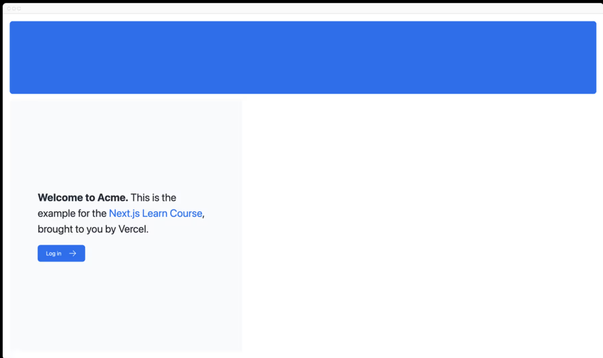

# 第2章 CSSスタイル
現在、ホームページにはスタイルがありません。Next.jsアプリケーションをスタイル設定するさまざまな方法を見てみましょう。

## この章では...

この章で扱うトピックは次のとおりです。
* アプリケーションにグローバル CSS ファイルを追加する方法。
* スタイリングの2つの異なる方法： Tailwind と CSS モジュール。
* clsx ユーティリティパッケージを使って条件付きでクラス名を追加する方法。

## グローバルスタイル
/app/uiフォルダの中を見ると、global.cssというファイルがあります。このファイルを使って、アプリケーションのすべてのルートにCSSルールを追加できます。たとえば、CSSのリセットルール、リンクのようなHTML要素のサイト全体のスタイルなどです。

アプリケーションのどのコンポーネントでもglobal.cssをインポートできますが、通常はトップレベルのコンポーネントに追加するのがよい習慣です。Next.jsでは、これがルートレイアウトです（これについては後で詳しく説明します）。

グローバルスタイルをアプリケーションに追加するには、/app/layout.tsxに移動して、global.cssファイルをインポートします：

```typescript
import '@/app/ui/global.css';

export default function RootLayout({
  children,
}: {
  children: React.ReactNode;
}) {
  return (
    <html lang="en">
      <body>{children}</body>
    </html>
  );
}
```
開発サーバーを起動したまま、変更を保存し、ブラウザでプレビューしてください。ホームページはこのようになるはずです。


でもちょっと待って、CSSルールを追加していないのに、スタイルはどこから来たのでしょうか？

global.cssの中を見てみると、@tailwindディレクティブがいくつかあることに気づくだろう

```typescript
@tailwind base;
@tailwind components;
@tailwind utilities;
```

## Tailwind
Tailwindは、TSXマークアップに直接ユーティリティ・クラスを素早く記述できるようにすることで、開発プロセスをスピードアップするCSSフレームワークです。

Tailwindでは、クラス名を追加することで要素をスタイリングします。たとえば、"text-blue-500 "というクラスを追加すると、`<h1>`のテキストが青くなります
```html
<h1 className="text-blue-500">青いです！</h1>
```
CSSスタイルはグローバルに共有されますが、各クラスは各要素に個別に適用されます。つまり、要素を追加または削除しても、別々のスタイルシートを維持したり、スタイルが衝突したり、アプリケーションの拡張に伴ってCSSバンドルのサイズが大きくなったりする心配はありません。

create-next-appを使用して新しいプロジェクトを開始すると、Next.jsはTailwindを使用するかどうかを尋ねます。yesを選択すると、Next.jsは自動的に必要なパッケージをインストールし、アプリケーションにTailwindを設定します。

`/app/page.tsx`を見ると、サンプルでTailwindクラスを使っていることがわかります。

Tailwindを使うのが初めてでもご心配なく。Tailwindを使うのが初めての方でもご安心ください。

Tailwindで遊んでみましょう！以下のコードをコピーして、/app/page.tsxの`<p>`要素の上に貼り付けてください

```tsx
<div
  className="relative w-0 h-0 border-l-[15px] border-r-[15px] border-b-[26px] border-l-transparent border-r-transparent border-b-black"
/>
```
※ 黒い三角形が表示される。

伝統的なCSSルールを書きたい場合や、スタイルをJSXから分離したい場合は、CSSモジュールが最適な選択肢となります。

## CSSモジュール
CSSモジュールでは、自動的にユニークなクラス名を作成することで、CSSをコンポーネントにスコープすることができます。

このコースではTailwindを使い続けますが、CSSモジュールを使って上と同じ結果を得る方法を少し見てみましょう。

app/ui内に、home.module.cssという新しいファイルを作成し、以下のCSSルールを追加します


```css
.shape {
  height: 0;
  width: 0;
  border-bottom: 30px solid black;
  border-left: 20px solid transparent;
  border-right: 20px solid transparent;
}
```

次に、/app/page.tsxファイル内でスタイルをインポートし、追加した`<div>`のTailwindクラス名をstyles.shapeに置き換えます

```tsx
import AcmeLogo from '@/app/ui/acme-logo';
import { ArrowRightIcon } from '@heroicons/react/24/outline';
import Link from 'next/link';
import styles from '@/app/ui/home.module.css';

export default function Page() {
  return (
    <main className="flex min-h-screen flex-col p-6">
      <div className={styles.shape} />
    // ...
  )
}
```


変更を保存し、ブラウザでプレビューする。以前と同じ形が表示されるはずです。

TailwindとCSSモジュールは、Next.jsアプリケーションをスタイリングする最も一般的な2つの方法です。どちらを使うかは好みの問題で、同じアプリケーションで両方を使うこともできます！

## clsxライブラリを使ってクラス名を切り替える
状態やその他の条件に基づいて、要素に条件付きでスタイルを設定する必要がある場合があります。

clsxは、クラス名を簡単に切り替えることができるライブラリです。詳しくはドキュメントを参照されることをお勧めしますが、基本的な使い方は以下の通りです

* ステータスを受け付けるInvoiceStatusコンポーネントを作成したいとします。ステータスは 'pending' または 'paid' です。
* 'paid' の場合、色は緑にします。'pending' の場合は灰色になります。

clsxを使って、このように条件付きでクラスを適用することができます
```tsx
import clsx from 'clsx';

export default function InvoiceStatus({ status }: { status: string }) {
  return (
    <span
      className={clsx(
        'inline-flex items-center rounded-full px-2 py-1 text-sm',
        {
          'bg-gray-100 text-gray-500': status === 'pending',
          'bg-green-500 text-white': status === 'paid',
        },
      )}
    >
    // ...
)}
```