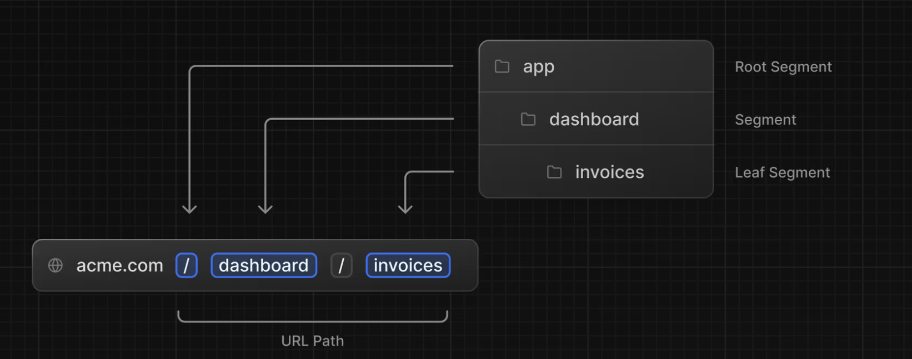
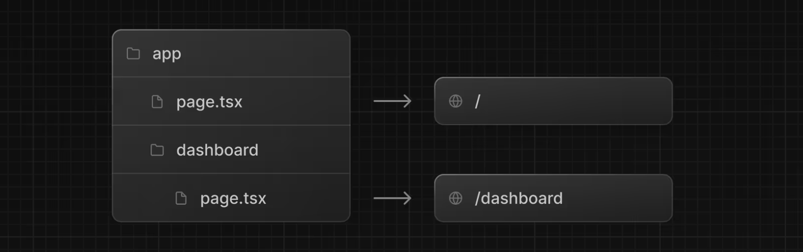
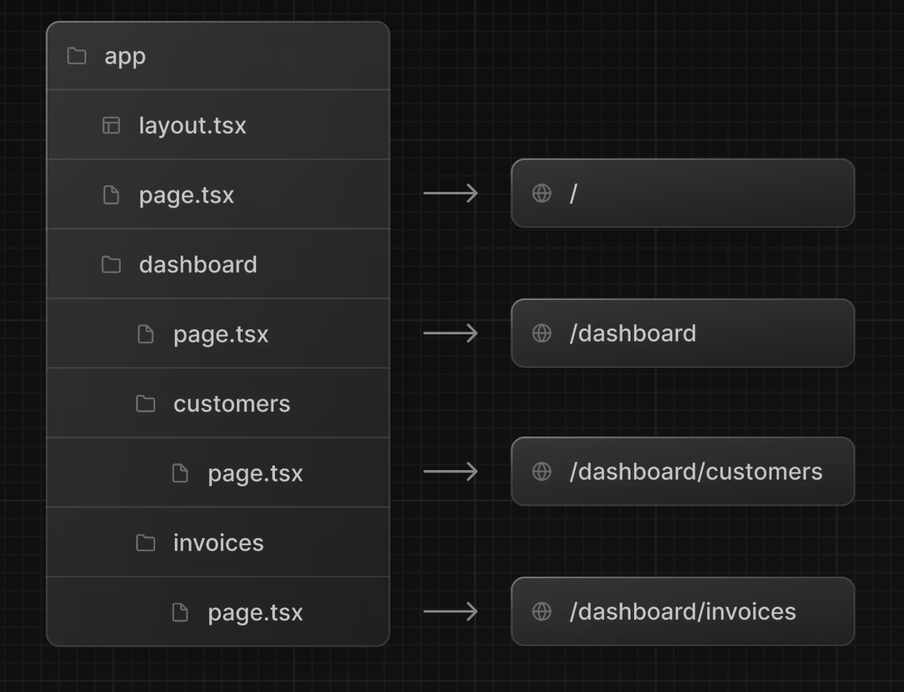
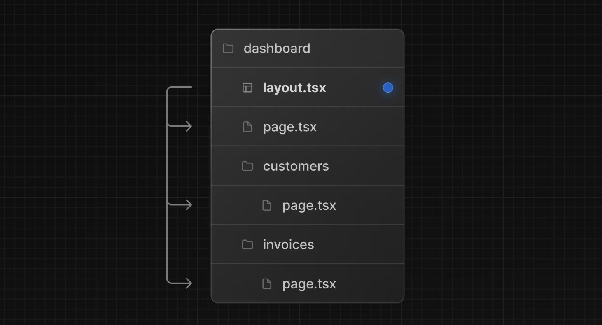
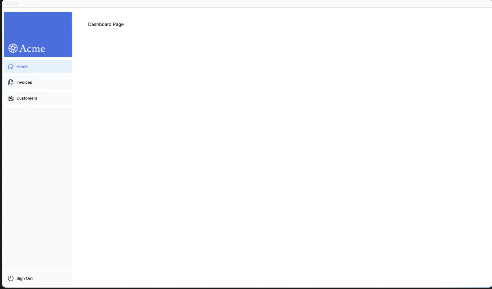
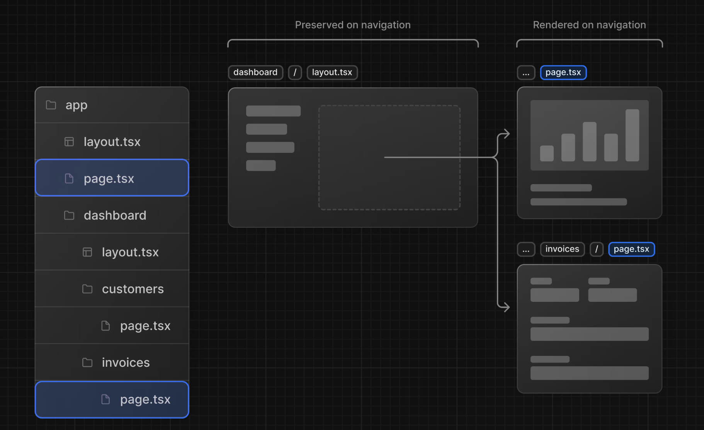

# 第4章 レイアウトとページの作成

これまでのところ、あなたのアプリケーションにはホームページしかありません。レイアウトとページでより多くのルートを作る方法を学びましょう。

## この章では...

この章で扱うトピックは次のとおりです

* ファイルシステムルーティングを使ってダッシュボードのルートを作る
* 新しいルートセグメントを作成するときのフォルダとファイルの役割を理解する。
* 複数のダッシュボードページ間で共有できるネストされたレイアウトを作成する。
* コロケーション、部分レンダリング、ルートレイアウトの意味を理解する。

## ネストされたルーティング
Next.jsでは、ネストされたルートを作成するためにフォルダを使用するファイルシステムルーティングを使用しています。各フォルダはURLセグメントにマッピングされたルートセグメントを表します。



layout.tsxファイルとpage.tsxファイルを使用して、ルートごとに個別のUIを作成できます。

page.tsxは、Reactコンポーネントをエクスポートする特別なNext.jsファイルで、ルートにアクセスするために必要です。アプリケーションには、すでにpageファイルがあります： /これはルート/に関連付けられたホームページです。

ネストされたルートを作成するには、フォルダ同士をネストし、その中にpage.tsxファイルを追加します。

例えば



/app/dashboard/page.tsxは/dashboardパスに関連付けられます。どのように動作するか、ページを作成してみましょう！

## ダッシュボードページの作成
appの中にdashboardという新しいフォルダを作成します。そして、dashboardフォルダの中に以下の内容で新しいpage.tsxファイルを作成します

```tsx
// app/dashboard/page.tsx


export default function Page() {
  return <p>Dashboard Page</p>;
}
```
開発用サーバーが起動していることを確認してください。
http://localhost:3000/dashboard

「Dashboard Page」というテキストが表示されるはずです。

このようにして、Next.jsでさまざまなページを作成することができます。フォルダを使用して新しいルートセグメントを作成し、その中にページファイルを追加します。

ページファイルに特別な名前をつけることで、Next.jsはUIコンポーネント、テストファイル、その他の関連コードをルートと一緒に配置することができます。ページファイル内のコンテンツだけが一般公開されます。たとえば、/uiフォルダと/libフォルダは、ルートとともに/appフォルダ内に配置されます。

## 練習 ダッシュボードページの作成
さらにルートを作る練習をしましょう。ダッシュボードに、さらに2つのページを作成します

1. 顧客ページ： このページは http://localhost:3000/dashboard/customers にアクセスできるようにする。今のところ、`<p>Customers Page</p>` 要素を返してください。
2. 請求書ページ： 請求書ページは http://localhost:3000/dashboard/invoices にアクセスできるようにする。今のところ、`<p>請求書ページ</p>` 要素も返してください。

このエクササイズに時間をかけて取り組み、準備ができたら、下のトグルを展開して解決策をご覧ください。

以下のようなフォルダ構成になっているはずだ。



```tsx
// app/dashboard/customers/page.tsx


export default function Page() {
  return <p>Customers Page</p>;
}
```

```tsx
// app/dashboard/invoices/page.tsx


export default function Page() {
  return <p>Invoices Page</p>;
}
```

## ダッシュボード・レイアウトの作成
ダッシュボードには、複数のページで共有される何らかのナビゲーションがあります。Next.jsでは、特別なlayout.tsxファイルを使用して、複数のページで共有されるUIを作成できます。ダッシュボードページのレイアウトを作成してみましょう！

dashboardフォルダ内にlayout.tsxという新しいファイルを追加し、次のコードを貼り付けます

```tsx
// app/dashboard/layout.tsx

import SideNav from '@/app/ui/dashboard/sidenav';

export default function Layout({ children }: { children: React.ReactNode }) {
  return (
    <div className="flex h-screen flex-col md:flex-row md:overflow-hidden">
      <div className="w-full flex-none md:w-64">
        <SideNav />
      </div>
      <div className="flex-grow p-6 md:overflow-y-auto md:p-12">{children}</div>
    </div>
  );
}
```

このコードではいくつかのことが行われています。

まず、`<SideNav />`コンポーネントをレイアウトにインポートしています。このファイルにインポートしたコンポーネントはすべてレイアウトの一部になります。

`<Layout />`コンポーネントはchildren propを受け取ります。この子にはページまたは別のレイアウトを指定できます。あなたの場合、/dashboard内のページは自動的に`<Layout />`の中にネストされます。



変更を保存してローカルホストをチェックし、すべてが正しく機能していることを確認します。以下のように表示されるはずです。



Next.jsでレイアウトを使用する利点の1つは、ナビゲーション時にページ コンポーネントだけが更新され、レイアウトは再レンダリングされないことです。これは部分レンダリングと呼ばれます。


