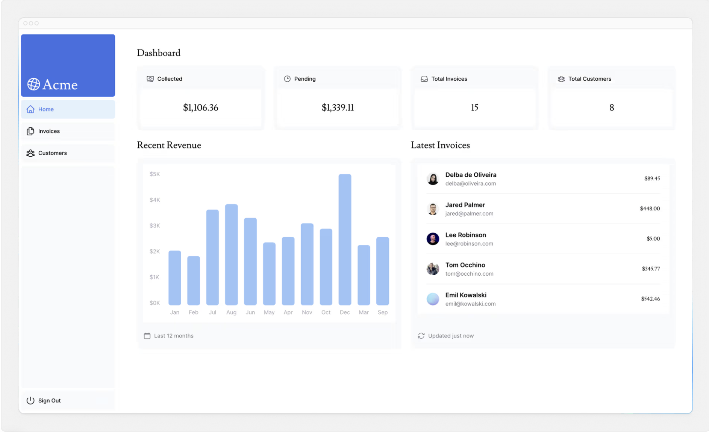
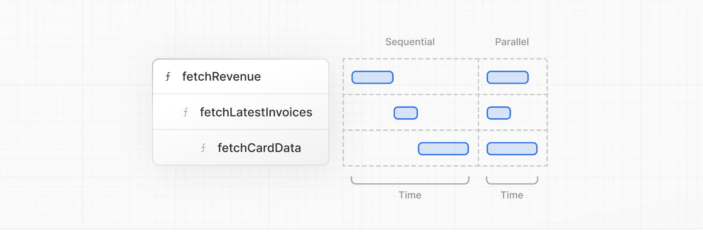

# 第7章 データの取得
データベースの作成とシードが完了したので、アプリケーションのデータを取得するさまざまな方法について説明し、ダッシュボードの概要ページを作成しましょう。

## この章では...

この章で扱うトピックは以下のとおりです。

* データを取得するためのいくつかのアプローチについて学びます： API、ORM、SQL など。
* Server Components を使用すると、バックエンドのリソースにより安全にアクセスできるようになります。
* ネットワーク・ウォーターフォールとは何か
* JavaScriptパターンを使って並列データフェッチを実装する方法

## データ取得方法の選択
### APIレイヤー
APIは、アプリケーション・コードとデータベースの間の中間層です。APIを使うケースはいくつかある

APIを提供しているサードパーティーのサービスを利用している場合。
クライアントからデータを取得する場合、データベースの秘密がクライアントに公開されないように、サーバー上で動作するAPIレイヤーを用意したい。
Next.jsでは、ルートハンドラを使ってAPIエンドポイントを作成できます。

### データベースクエリ
フルスタックのアプリケーションを作るときには、データベースとやりとりするロジックも書く必要があります。Postgresのようなリレーショナルデータベースの場合、SQLやORMを使ってこれを行うことができます。

データベースのクエリを書かなければならないケースもいくつかある

* APIエンドポイントを作成する際に、データベースとやり取りするロジックを記述する必要があります。
* React Server Components（サーバー上でデータを取得する）を使用している場合は、APIレイヤーをスキップして、データベースの秘密をクライアントに公開するリスクを冒すことなく、データベースに直接問い合わせることができます。

それでは、React Server Componentsについて詳しく説明しよう。

## データ取得にServer Componentsを使用する
デフォルトでは、Next.jsアプリケーションはReact Server Componentsを使用します。Server Componentsを使用したデータ取得は比較的新しいアプローチですが、Server Componentsを使用する利点がいくつかあります

Server Componentsはpromiseをサポートし、データ取得のような非同期タスクのためのシンプルなソリューションを提供します。useEffectやuseState、データ取得ライブラリに手を伸ばすことなく、async/await構文を使用できます。

Server Componentsはサーバー上で実行されるため、高価なデータ取得やロジックをサーバー上に保持し、結果のみをクライアントに送信することができます。

前述のように、Server Componentsはサーバー上で実行されるため、APIレイヤーを追加することなく、データベースに直接問い合わせることができます。

## SQLの使用
ダッシュボードプロジェクトでは、Vercel Postgres SDKとSQLを使用してデータベースクエリを記述します。SQLを使う理由はいくつかあります

SQLはリレーショナルデータベースをクエリするための業界標準です（例えば、ORMはフードの下でSQLを生成します）。
SQLの基本を理解することで、リレーショナル・データベースの基本を理解することができ、その知識を他のツールに応用することができます。
SQLは汎用性が高く、特定のデータを取得して操作することができます。
Vercel Postgres SDKはSQLインジェクションからの保護を提供します。
SQLを使ったことがなくても心配しないでください。

app/lib/data.tsにアクセスしてください。ここでは@vercel/postgresからsql関数をインポートしていることがわかります。この関数を使うと、データベースに問い合わせることができます

どのサーバーコンポーネント内でもsqlを呼び出すことができます。しかし、より簡単にコンポーネントをナビゲートできるように、すべてのデータクエリをdata.tsファイルに保持し、コンポーネントにインポートできるようにしています。

**注意**：第6章で独自のデータベース・プロバイダを使用した場合、あなたのプロバイダで動作するようにデータベース・クエリを更新する必要があります。クエリは/app/lib/data.tsにあります。

## ダッシュボードの概要ページ用にデータをフェッチする
データをフェッチするさまざまな方法を理解したところで、ダッシュボードの概要ページのデータをフェッチしてみましょう。/app/dashboard/page.tsxに移動し、以下のコードを貼り付けて、しばらく時間をかけて探索してください

```tsx
// app/dashboard/page.tsx

import { Card } from '@/app/ui/dashboard/cards';
import RevenueChart from '@/app/ui/dashboard/revenue-chart';
import LatestInvoices from '@/app/ui/dashboard/latest-invoices';
import { lusitana } from '@/app/ui/fonts';

export default async function Page() {
  return (
    <main>
      <h1 className={`${lusitana.className} mb-4 text-xl md:text-2xl`}>
        Dashboard
      </h1>
      <div className="grid gap-6 sm:grid-cols-2 lg:grid-cols-4">
        {/* <Card title="Collected" value={totalPaidInvoices} type="collected" /> */}
        {/* <Card title="Pending" value={totalPendingInvoices} type="pending" /> */}
        {/* <Card title="Total Invoices" value={numberOfInvoices} type="invoices" /> */}
        {/* <Card
          title="Total Customers"
          value={numberOfCustomers}
          type="customers"
        /> */}
      </div>
      <div className="mt-6 grid grid-cols-1 gap-6 md:grid-cols-4 lg:grid-cols-8">
        {/* <RevenueChart revenue={revenue}  /> */}
        {/* <LatestInvoices latestInvoices={latestInvoices} /> */}
      </div>
    </main>
  );
}
```

上のコードでは
* Pageは非同期コンポーネントである。これにより、awaitを使ってデータを取得することができる。
* また、データを受け取るコンポーネントが3つあります： `<Card>`, `<RevenueChart>`, `<LatestInvoices>` です。これらは現在、アプリケーションのエラーを防ぐためにコメントアウトされています。

## `<RevenueChart/>`のデータをフェッチする
`<RevenueChart/>`コンポーネントのデータを取得するには、data.tsからfetchRevenue関数をインポートし、コンポーネント内で呼び出します

```tsx
// app/dashboard/page.tsx

import { Card } from '@/app/ui/dashboard/cards';
import RevenueChart from '@/app/ui/dashboard/revenue-chart';
import LatestInvoices from '@/app/ui/dashboard/latest-invoices';
import { lusitana } from '@/app/ui/fonts';
import { fetchRevenue } from '@/app/lib/data';

export default async function Page() {
  const revenue = await fetchRevenue();
  // ...
}
```

次に、`<RevenueChart/>`コンポーネントのコメントを解除し、コンポーネントファイル（/app/ui/dashboard/revenue-chart.tsx）に移動して、その中のコードをアンコメントしてください。ローカルホストをチェックすると、収益データを使ったチャートが表示されているはずです。

さらにデータクエリのインポートを続けよう！

## `<LatestInvoices/>`のデータ取得
`<LatestInvoices />`コンポーネントでは、日付順に並べ替えられた最新5件の請求書を取得する必要があります。

JavaScriptを使ってすべての請求書を取得し、並べ替えることができます。しかし、アプリケーションの規模が大きくなるにつれて、リクエストごとに転送されるデータ量と、それをソートするために必要なJavaScriptの量が大幅に増える可能性があります。

インメモリで最新の請求書をソートする代わりに、SQLクエリを使って直近の5件の請求書だけを取得することができます。例えば、これはdata.tsファイルのSQLクエリです

```typescript
// app/lib/data.ts

// Fetch the last 5 invoices, sorted by date
const data = await sql<LatestInvoiceRaw>`
  SELECT invoices.amount, customers.name, customers.image_url, customers.email
  FROM invoices
  JOIN customers ON invoices.customer_id = customers.id
  ORDER BY invoices.date DESC
  LIMIT 5`;
```

あなたのページで fetchLatestInvoices 関数をインポートします

```tsx
// app/dashboard/page.tsx

import { Card } from '@/app/ui/dashboard/cards';
import RevenueChart from '@/app/ui/dashboard/revenue-chart';
import LatestInvoices from '@/app/ui/dashboard/latest-invoices';
import { lusitana } from '@/app/ui/fonts';
import { fetchRevenue, fetchLatestInvoices } from '@/app/lib/data';

export default async function Page() {
  const revenue = await fetchRevenue();
  const latestInvoices = await fetchLatestInvoices();
  // ...
}
```

次に、`<LatestInvoices />`コンポーネントのコメントを外します。また、/app/ui/dashboard/latest-invoicesにある`<LatestInvoices />`コンポーネント自体の関連するコードのコメントも解除する必要があります。

localhostにアクセスすると、最後の5件だけがデータベースから返されていることがわかるはずです。データベースを直接クエリすることの利点がわかっていただけたと思います！

## 実践：`<Card>`コンポーネントのデータ取得
次は`<Card>`コンポーネントのデータを取得する番だ。カードには以下のデータが表示されます

* 回収した請求書の総額
* 保留中の請求書の合計金額
* 請求書の総数
* 顧客の総数。

ここでも、すべての請求書と顧客を取得し、JavaScriptを使ってデータを操作したくなるかもしれません。例えば、Array.lengthを使って請求書と顧客の総数を取得することができます

```javascript
const totalInvoices = allInvoices.length;
const totalCustomers = allCustomers.length;
```

しかしSQLを使えば、必要なデータだけを取り出すことができる。Array.lengthを使うより少し長くなりますが、リクエスト中に転送するデータが少なくて済みます。これがSQLの代替案です

```typescript
const invoiceCountPromise = sql`SELECT COUNT(*) FROM invoices`;
const customerCountPromise = sql`SELECT COUNT(*) FROM customers`;
```
インポートする必要がある関数は fetchCardData です。この関数から返される値を再構築する必要があります。

**ヒント**：
カード・コンポーネントがどのようなデータを必要としているかを確認する。
data.tsファイルをチェックして、関数が何を返すかを確認する。
準備ができたら、下のトグルを展開して最終的なコードをご覧ください

```tsx
// app/dashboard/page.tsx

import { Card } from '@/app/ui/dashboard/cards';
import RevenueChart from '@/app/ui/dashboard/revenue-chart';
import LatestInvoices from '@/app/ui/dashboard/latest-invoices';
import { lusitana } from '@/app/ui/fonts';
import {
  fetchRevenue,
  fetchLatestInvoices,
  fetchCardData,
} from '@/app/lib/data';

export default async function Page() {
  const revenue = await fetchRevenue();
  const latestInvoices = await fetchLatestInvoices();
  const {
    numberOfInvoices,
    numberOfCustomers,
    totalPaidInvoices,
    totalPendingInvoices,
  } = await fetchCardData();

  return (
    <main>
      <h1 className={`${lusitana.className} mb-4 text-xl md:text-2xl`}>
        Dashboard
      </h1>
      <div className="grid gap-6 sm:grid-cols-2 lg:grid-cols-4">
        <Card title="Collected" value={totalPaidInvoices} type="collected" />
        <Card title="Pending" value={totalPendingInvoices} type="pending" />
        <Card title="Total Invoices" value={numberOfInvoices} type="invoices" />
        <Card
          title="Total Customers"
          value={numberOfCustomers}
          type="customers"
        />
      </div>
      <div className="mt-6 grid grid-cols-1 gap-6 md:grid-cols-4 lg:grid-cols-8">
        <RevenueChart revenue={revenue} />
        <LatestInvoices latestInvoices={latestInvoices} />
      </div>
    </main>
  );
}
```

素晴らしい！これでダッシュボードの概要ページに必要なすべてのデータが取得できました。ページはこのようになるはずです
)

しかし...注意しなければならないことが2つある

1. データリクエストが意図せず互いにブロックされ、リクエストウォーターフォールが発生しています。
2. デフォルトでは、Next.jsはパフォーマンスを向上させるためにルートをプリレンダリングします。そのため、データが変更されてもダッシュボードには反映されません。

この章ではその1について説明し、次の章ではその2について詳しく見ていきましょう。

## リクエスト・ウォーターフォールとは？
「ウォーターフォール」とは、前のリクエストの完了に依存する一連のネットワーク・リクエストのことを指す。データ・フェッチの場合、各リクエストは、前のリクエストがデータを返して初めて開始できる。



例えば、fetchLatestInvoices()が実行される前に、fetchRevenue()が実行されるのを待つ必要がある。

```tsx
// app/dashboard/page.tsx

const revenue = await fetchRevenue();
const latestInvoices = await fetchLatestInvoices(); // wait for fetchRevenue() to finish
const {
  numberOfInvoices,
  numberOfCustomers,
  totalPaidInvoices,
  totalPendingInvoices,
} = await fetchCardData(); // wait for fetchLatestInvoices() to finish
```
このパターンが必ずしも悪いわけではない。ウォーターフォールが必要なのは、次のリクエストをする前に条件を満たしたいからかもしれません。例えば、最初にユーザーのIDとプロフィール情報を取得したい場合です。IDを取得したら、次に友達のリストを取得する。この場合、各リクエストは前のリクエストから返されたデータに依存しています。

しかし、この動作は意図せずパフォーマンスに影響を与えることもあります。

## 並列データフェッチ
ウォーターフォールを回避する一般的な方法は、すべてのデータ要求を同時に、つまり並列に開始することです。

JavaScriptでは、Promise.all()またはPromise.allSettled()関数を使用して、すべてのプロミスを同時に開始することができます。例えば、data.tsではfetchCardData()関数でPromise.all()を使っています

```typescript
// app/lib/data.ts

export async function fetchCardData() {
  try {
    const invoiceCountPromise = sql`SELECT COUNT(*) FROM invoices`;
    const customerCountPromise = sql`SELECT COUNT(*) FROM customers`;
    const invoiceStatusPromise = sql`SELECT
         SUM(CASE WHEN status = 'paid' THEN amount ELSE 0 END) AS "paid",
         SUM(CASE WHEN status = 'pending' THEN amount ELSE 0 END) AS "pending"
         FROM invoices`;

    const data = await Promise.all([
      invoiceCountPromise,
      customerCountPromise,
      invoiceStatusPromise,
    ]);
    // ...
  }
}
```

このパターンを使うことで
* すべてのデータ取得を同時に実行し始めることで、パフォーマンスを向上させることができる。
* どんなライブラリやフレームワークにも適用できるネイティブのJavaScriptパターンを使う。

しかし、このJavaScriptパターンにのみ依存するデメリットが1つあります。1つのデータリクエストが他のすべてのリクエストよりも遅い場合はどうなるでしょうか？

第7章を終了しました

Next.jsでデータを取得するさまざまな方法について学びました。
