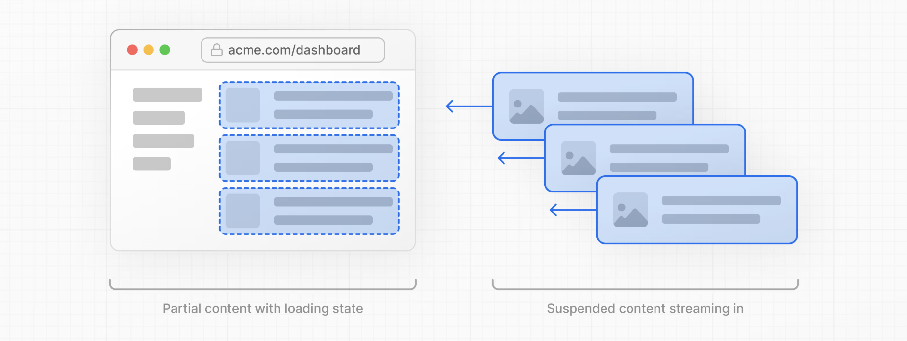
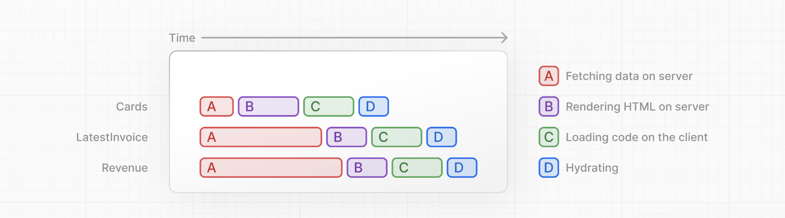
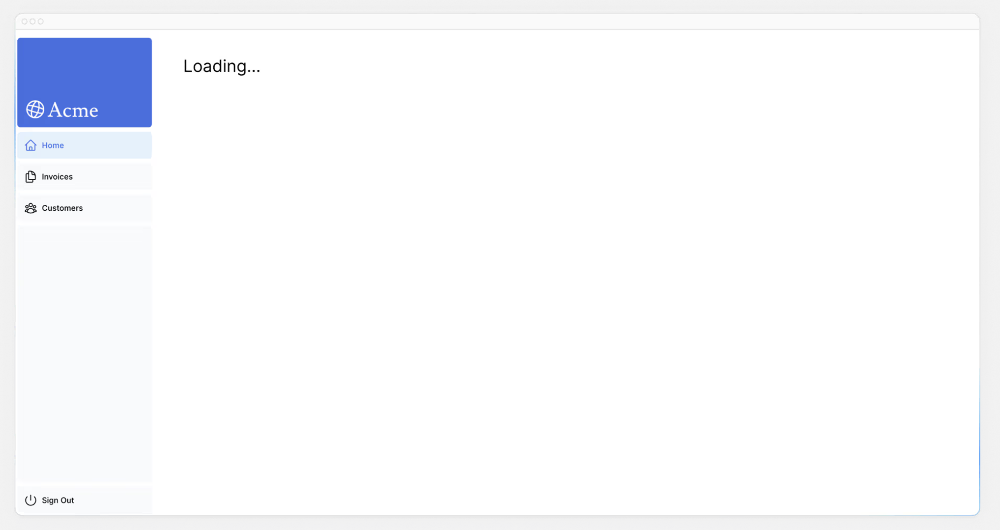
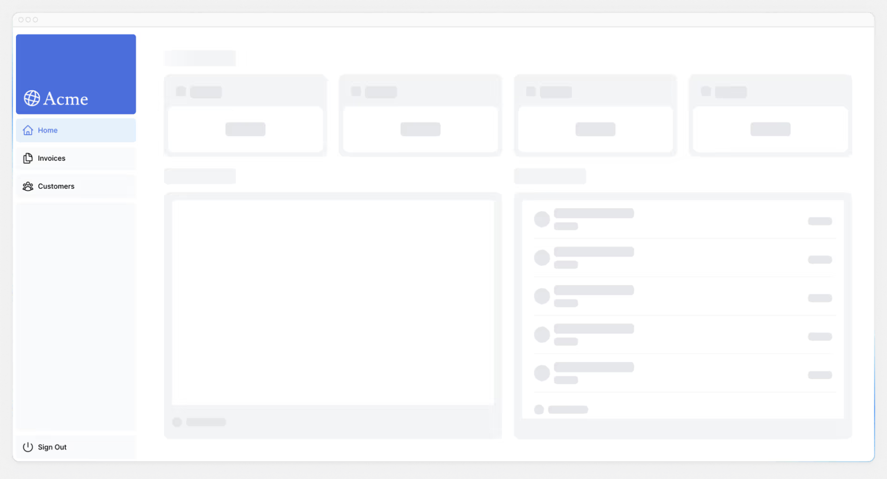

# 第9章 ストリーミング
前の章では、Next.jsのさまざまなレンダリング方法について学びました。また、遅いデータ取得がアプリケーションのパフォーマンスにどのような影響を与えるかについても説明しました。ここでは、遅いデータ要求があったときにユーザーエクスペリエンスを向上させる方法について説明します。

## この章では...
この章で取り上げるトピックは次のとおりです。

ストリーミングとは何か？
* loading.tsxとSusppenseを使ってストリーミングを実装する方法。
* ローディング・スケルトンとは何か
* ルートグループとは何か、どのような場合に使用するのか
* アプリケーションのどこにSuspenseの境界線を配置するか

## ストリーミングとは？
ストリーミングとは、データ転送のテクニックの一つで、経路をより小さな「チャンク」に分割し、準備が整うごとにサーバーからクライアントへ順次送信していく方法です。



ストリーミングによって、遅いデータ・リクエストがページ全体をブロックするのを防ぐことができます。これにより、UIがユーザーに表示される前にすべてのデータがロードされるのを待つことなく、ユーザーはページの一部を見て操作することができます。



ストリーミングはReactのコンポーネントモデルと相性がよく、各コンポーネントをチャンクとみなすことができるからだ。

Next.jsでストリーミングを実装する方法は2つあります

ページレベルで、loading.tsxファイルを使う。
特定のコンポーネントに対して、`<Suspense>`を使う方法です。
この方法を見てみましょう。

## loading.tsxを使ったページ全体のストリーミング
/app/dashboardフォルダに、loading.tsxという新しいファイルを作成します

```tsx
// app/dashboard/loading.tsx

export default function Loading() {
  return <div>Loading...</div>;
}
```

http://localhost:3000/dashboard リフレッシュしてください



ここではいくつかのことが起こっています

1. loading.tsxは、Susppenseの上に構築された特別なNext.jsファイルで、ページのコンテンツがロードされる間に代替として表示するフォールバックUIを作成できます。
2. `<SideNav>`は静的なので、すぐに表示されます。動的コンテンツがロードされている間、ユーザーは<SideNav>と対話することができます。
3. ユーザーはページの読み込みが終わるのを待ってからナビゲートする必要はありません（これは中断可能なナビゲーションと呼ばれます）。

おめでとうございます！これでストリーミングの実装は完了です。しかし、ユーザーエクスペリエンスを向上させるためにもっとできることがあります。Loading...のテキストの代わりにローディングのスケルトンを表示してみましょう。

### ローディング・スケルトンの追加
ローディング・スケルトンは、UIの簡易版です。多くのウェブサイトでは、コンテンツがロード中であることをユーザーに示すためのプレースホルダー（またはフォールバック）として使用します。loading.tsxに追加したUIは、静的ファイルの一部として埋め込まれ、最初に送信されます。その後、残りの動的コンテンツがサーバーからクライアントにストリーミングされます。

loading.tsxファイル内で、`<DashboardSkeleton>`と呼ばれる新しいコンポーネントをインポートします

```tsx
// app/dashboard/loading.tsx

import DashboardSkeleton from '@/app/ui/skeletons';

export default function Loading() {
  return <DashboardSkeleton />;
}
```
その後、http://localhost:3000/dashboard リフレッシュしてください



### ルートグループでのローディングスケルトンのバグ修正
現在、ローディングスケルトンは請求書と顧客のページにも適用されます。

loading.tsxはファイルシステム上、/invoices/page.tsxや/customers/page.tsxよりも上位にあるため、これらのページにも適用されます。

これはRoute Groupsで変更できます。dashboardフォルダ内に/(overview)という新しいフォルダを作成します。そして、loading.tsxとpage.tsxファイルをそのフォルダ内に移動します


これで、loading.tsx ファイルはダッシュボードの概要ページにのみ適用されます。

ルートグループを使用すると、URLパス構造に影響を与えることなく、ファイルを論理的なグループにまとめることができます。括弧（）を使用して新しいフォルダを作成すると、その名前はURLパスに含まれません。つまり、/dashboard/(overview)/page.tsxは/dashboardになります。

ここでは、loading.tsxがダッシュボードの概要ページにのみ適用されるように、ルートグループを使っています。しかし、ルートグループを使って、アプリケーションをセクションに分けたり（例えば、(マーケティング)ルートと(ショップ)ルート）、大規模なアプリケーションのためにチームごとに分けることもできます。

### コンポーネントのストリーミング
ここまでは、ページ全体をストリーミングしています。しかし、React Suspenseを使えばもっと細かく、特定のコンポーネントをストリーミングすることもできます。

Susppenseを使うと、何らかの条件が満たされるまで（例えばデータが読み込まれるまで）アプリケーションの一部のレンダリングを延期できます。動的コンポーネントをSusppenseでラップできます。そして、動的コンポーネントがロードされる間に表示するフォールバックコンポーネントを渡します。

fetchRevenue()という遅いデータリクエストを覚えているなら、これはページ全体を遅くしているリクエストです。ページ全体をブロックする代わりに、Susppenseを使用してこのコンポーネントだけをストリーミングし、ページの残りのUIをすぐに表示することができます。

そのためには、データの取得をコンポーネントに移す必要があります：

fetchRevenue()のすべてのインスタンスとそのデータを/dashboard/(overview)/page.tsxから削除します

```tsx
// app/dashboard/(overview)/page.tsx

import { Card } from '@/app/ui/dashboard/cards';
import RevenueChart from '@/app/ui/dashboard/revenue-chart';
import LatestInvoices from '@/app/ui/dashboard/latest-invoices';
import { lusitana } from '@/app/ui/fonts';
import { fetchLatestInvoices, fetchCardData } from '@/app/lib/data'; // remove fetchRevenue

export default async function Page() {
  const revenue = await fetchRevenue() // delete this line
  const latestInvoices = await fetchLatestInvoices();
  const {
    numberOfInvoices,
    numberOfCustomers,
    totalPaidInvoices,
    totalPendingInvoices,
  } = await fetchCardData();

  return (
    // ...
  );
}
```

次に、Reactから`<Suspense>`をインポートし、`<RevenueChart />`で囲みます。`<RevenueChartSkeleton>` というフォールバックコンポーネントを渡すことができます。

```tsx
// app/dashboard/(overview)/page.tsx

import { Card } from '@/app/ui/dashboard/cards';
import RevenueChart from '@/app/ui/dashboard/revenue-chart';
import LatestInvoices from '@/app/ui/dashboard/latest-invoices';
import { lusitana } from '@/app/ui/fonts';
import { fetchLatestInvoices, fetchCardData } from '@/app/lib/data';
import { Suspense } from 'react';
import { RevenueChartSkeleton } from '@/app/ui/skeletons';

export default async function Page() {
  const latestInvoices = await fetchLatestInvoices();
  const {
    numberOfInvoices,
    numberOfCustomers,
    totalPaidInvoices,
    totalPendingInvoices,
  } = await fetchCardData();

  return (
    <main>
      <h1 className={`${lusitana.className} mb-4 text-xl md:text-2xl`}>
        Dashboard
      </h1>
      <div className="grid gap-6 sm:grid-cols-2 lg:grid-cols-4">
        <Card title="Collected" value={totalPaidInvoices} type="collected" />
        <Card title="Pending" value={totalPendingInvoices} type="pending" />
        <Card title="Total Invoices" value={numberOfInvoices} type="invoices" />
        <Card
          title="Total Customers"
          value={numberOfCustomers}
          type="customers"
        />
      </div>
      <div className="mt-6 grid grid-cols-1 gap-6 md:grid-cols-4 lg:grid-cols-8">
        <Suspense fallback={<RevenueChartSkeleton />}>
          <RevenueChart />
        </Suspense>
        <LatestInvoices latestInvoices={latestInvoices} />
      </div>
    </main>
  );
}
```

最後に、`<RevenueChart>`コンポーネントを更新して、それ自身のデータを取得し、渡されたpropを削除します

```tsx
// app/ui/dashboard/revenue-chart.tsx

import { generateYAxis } from '@/app/lib/utils';
import { CalendarIcon } from '@heroicons/react/24/outline';
import { lusitana } from '@/app/ui/fonts';
import { fetchRevenue } from '@/app/lib/data';

// ...

export default async function RevenueChart() { // Make component async, remove the props
  const revenue = await fetchRevenue(); // Fetch data inside the component

  const chartHeight = 350;
  const { yAxisLabels, topLabel } = generateYAxis(revenue);

  if (!revenue || revenue.length === 0) {
    return <p className="mt-4 text-gray-400">No data available.</p>;
  }

  return (
    // ...
  );
}
```

ページを更新すると、ダッシュボードの情報がすぐに表示され、`<RevenueChart>`についてはフォールバック・スケルトンが表示されます

### 練習：ストリーミング`<LatestInvoices>`
次はあなたの番です！`<LatestInvoices>` コンポーネントをストリーミングして、今学んだことを練習してみましょう。

fetchLatestInvoices() をページから `<LatestInvoices>` コンポーネントに移動します。`<LatestInvoicesSkeleton>`というフォールバックを持つ`<Suspense>`境界でコンポーネントを包みます。

準備ができたら、トグルを展開してソリューションコードを見てください

Dashboard Page:

```tsx
// app/dashboard/(overview)/page.tsx

import { Card } from '@/app/ui/dashboard/cards';
import RevenueChart from '@/app/ui/dashboard/revenue-chart';
import LatestInvoices from '@/app/ui/dashboard/latest-invoices';
import { lusitana } from '@/app/ui/fonts';
import { fetchCardData } from '@/app/lib/data'; // Remove fetchLatestInvoices
import { Suspense } from 'react';
import {
  RevenueChartSkeleton,
  LatestInvoicesSkeleton,
} from '@/app/ui/skeletons';

export default async function Page() {
  // Remove `const latestInvoices = await fetchLatestInvoices()`
  const {
    numberOfInvoices,
    numberOfCustomers,
    totalPaidInvoices,
    totalPendingInvoices,
  } = await fetchCardData();

  return (
    <main>
      <h1 className={`${lusitana.className} mb-4 text-xl md:text-2xl`}>
        Dashboard
      </h1>
      <div className="grid gap-6 sm:grid-cols-2 lg:grid-cols-4">
        <Card title="Collected" value={totalPaidInvoices} type="collected" />
        <Card title="Pending" value={totalPendingInvoices} type="pending" />
        <Card title="Total Invoices" value={numberOfInvoices} type="invoices" />
        <Card
          title="Total Customers"
          value={numberOfCustomers}
          type="customers"
        />
      </div>
      <div className="mt-6 grid grid-cols-1 gap-6 md:grid-cols-4 lg:grid-cols-8">
        <Suspense fallback={<RevenueChartSkeleton />}>
          <RevenueChart />
        </Suspense>
        <Suspense fallback={<LatestInvoicesSkeleton />}>
          <LatestInvoices />
        </Suspense>
      </div>
    </main>
  );
}
```

`<LatestInvoices>` コンポーネントです。propsを削除することを忘れないでください

```tsx
// app/ui/dashboard/latest-invoices.tsx

import { ArrowPathIcon } from '@heroicons/react/24/outline';
import clsx from 'clsx';
import Image from 'next/image';
import { lusitana } from '@/app/ui/fonts';
import { fetchLatestInvoices } from '@/app/lib/data';

export default async function LatestInvoices() { // Remove props
  const latestInvoices = await fetchLatestInvoices();

  return (
    // ...
  );
}
```

## コンポーネントのグループ化
素晴らしい！もう少し、<カード>コンポーネントをサスペンスでラップする必要があります。個々のカードごとにデータを取得することもできますが、この場合、カードが読み込まれるときにポップエフェクトが発生する可能性があります。

では、この問題にどのように対処しますか？

より時差効果を出すには、ラッパーコンポーネントを使ってカードをグループ化します。つまり、静的な`<SideNav/>`が最初に表示され、次にカードなどが表示されます。

page.tsxファイルを開きます：

* `<Card>`コンポーネントを削除してください。
* fetchCardData()関数を削除してください。
* `<CardWrapper />`という新しいラッパー・コンポーネントをインポートします。
* `<CardsSkeleton />`という新しいスケルトン・コンポーネントをインポートします。
* `<CardWrapper />` をサスペンスでラップします。

```tsx
// app/dashboard/page.tsx

import CardWrapper from '@/app/ui/dashboard/cards';
// ...
import {
  RevenueChartSkeleton,
  LatestInvoicesSkeleton,
  CardsSkeleton,
} from '@/app/ui/skeletons';

export default async function Page() {
  return (
    <main>
      <h1 className={`${lusitana.className} mb-4 text-xl md:text-2xl`}>
        Dashboard
      </h1>
      <div className="grid gap-6 sm:grid-cols-2 lg:grid-cols-4">
        <Suspense fallback={<CardsSkeleton />}>
          <CardWrapper />
        </Suspense>
      </div>
      // ...
    </main>
  );
}
```

次に、/app/ui/dashboard/cards.tsxに移動し、fetchCardData()関数をインポートして、<CardWrapper/>コンポーネント内で呼び出してください。このコンポーネントで必要なコードがあれば、必ずアンコメントしてください。

```tsx
// app/ui/dashboard/cards.tsx

// ...
import { fetchCardData } from '@/app/lib/data';

// ...

export default async function CardWrapper() {
  const {
    numberOfInvoices,
    numberOfCustomers,
    totalPaidInvoices,
    totalPendingInvoices,
  } = await fetchCardData();

  return (
    <>
      <Card title="Collected" value={totalPaidInvoices} type="collected" />
      <Card title="Pending" value={totalPendingInvoices} type="pending" />
      <Card title="Total Invoices" value={numberOfInvoices} type="invoices" />
      <Card
        title="Total Customers"
        value={numberOfCustomers}
        type="customers"
      />
    </>
  );
}
```

ページを更新すると、すべてのカードが同時に読み込まれるのが見えるはずだ。複数のコンポーネントを同時にロードしたいときに、このパターンを使うことができます。
